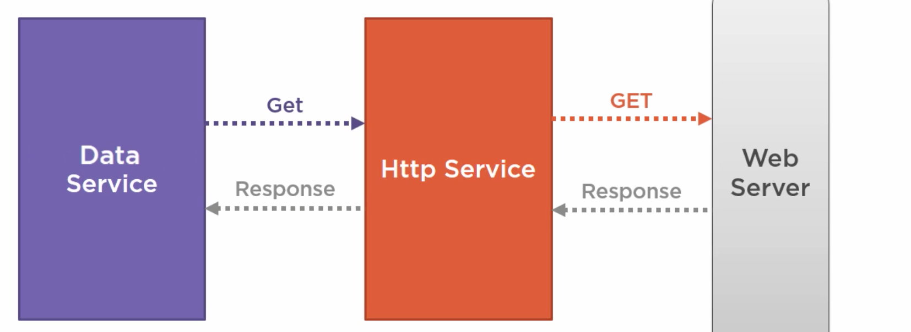
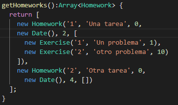

# Angular: Http y Observables y Más sobre Routing

## Interactuando con una API REST a través de HTTP. Observables 

Los datos a usar en nuestra aplicación van a estar almacenados en algún lado; en la nube, en un servidor en nuestra misma red, en nuestra pc de escritorio, etc. ¿Cómo hacemos para lograr traer esos datos y meterlos dentro de nuestras Views?

En este módulo aprenderemos a enviar HTTP requests con **Observables** para obtener datos. La mayoría de las aplicaciones hechas en Angular obtienen datos usando HTTP. ¿Cuál es el flujo que se da?

1. La aplicación envía una request a un servidor/web service (HTTP GET ../api/homeworks/2)

2. Ese Web Service obtiene los datos, seguramente accediendo a una base de datos.

3. El Web Service le contesta a la aplicación, con los datos obtenidos, en forma de una HTTP Response.

4. La aplicación procesa entonces los datos (por ej: los muestra en una View).



### Observables y las ‘Reactive Extensions’

Los Observables nos permiten manejar datos asincrónicos, como los datos que vendrán de nuestro *backend* o de algún *web service*.

Los mismos tratan a los eventos como una colección; podemos pensar a un Observable como un array de elementos que van llegando asincrónicamente a medida que pasa el tiempo. Hoy en día no tenemos Observables, estos son una feature propuesta para ES2016 (versión superior de JavaScript), por lo que para poder usarlos debemos utilizar una librería de terceros: **RxJS** o **Reactive Extensions**. No confundir esto con ReactJS.

Los **Observables** se usan incluso dentro de Angular, en su sistema de eventos o en su servicio HTTP (motivo por el cual lo estamos viendo).

A su vez, los **Observables** tienen métodos. La gracia de estos métodos es que, una vez se aplican sobre un **Observable**, estos realizan alguna transformación sobre el  **Observable** original, y lo retornan. Estos métodos siempre devuelven un **Observable**, permitiendo concatenar llamadas sobre un **Observable** de forma simple. Ejemplo: *map*, *filter*, *take*, *merge*, etc.

Una vez tengamos nuestros Observables, un método en nuestro código puede **suscribirse a un Observable**, para **recibir notificaciones asincrónicas a medida que nuevos datos vayan llegand**o. Dicho método puede entonces “reaccionar”, sobre esos datos. Dicho método a su vez es notificado cuando no hay más datos, o cuando un error ocurre.

### Observables vs Promises

Otra forma bastante común de obtener datos a través de HTTP es usando **promises**. Las promises/promesas son objetos de JavaScript que sirven para hacer computación asincrónica, representando un cierto valor que puede estar ahora, en el futuro o nunca. Estas permiten setear manejadores (funciones o callbacks), que ejecuten comportamiento una vez que el valor esté disponible. Las llamadas por HTTP, pueden ser manejadas a través de promesas. Esto permite que métodos asíncronicos devuelvan valores como si fueran sincrónicos: en vez de inmediatamente retornar el valor final, el método asincrónico devuelve una promesa de suministrar el valor en algún momento en el futuro.

Tanto Observables como Promises sirven para lo mismo, pero los Observables permiten hacer más cosas:

- Los Observables permiten **cancelar la suscripción**, mientras que las Promises no. Si el resultado de una request HTTP a un servidor o alguna otra operación costosa que es asincrónica no es más necesaria, el objeto **Suscription** sobre un Observable puede ser cancelado. 
- Las Promises manejan un único evento, cuando una operación asincrónica completa o falla. Los Observables son como los Stream (en muchos lenguajes), y permiten pasar cero o más eventos donde el callback será llamado para cada evento.
- En general, se suelen usar Observables porque permiten hacer lo mismo que las Promises y más.
- Los Observables proveen operadores como *map*, *forEach*, *reduce*, similares a un array.

### Tutorial: Consumiendo nuestra API

Como ya hemos vistos, los servicios de Angular son una excelente forma de encapsular lógica como la obtención de datos de un web service / backend, para que cualquier otro componente o service que lo precise lo use, a través de inyección de dependencias. En la clase anterior hicimos eso, pero manteniendo una lista hardcodeada de tareas. En su lugar, queremos enviar una solicitud HTTP para obtener las tareas. 

Así tenemos ahora las tareas:



Angular provee un Servicio HTTP que nos permite llevar a cabo esto; donde luego de comunicarnos con el backend, cada vez que este nos responda, la respuesta llegará a nuestro servicio (HomeworksService), en forma de Observable.

#### 1. Registramos el HttpModule en el AppModule

- En ```app.module.ts```, importamos el módulo que precisamos para hacer solicitudes Http.

```typescript
import { HttpModule } from '@angular/http';
```

A su vez necesitamos registrar el provider de ese service, en el Angular Injector. Como en muchos casos, esto ya viene hecho, gracias a que particularmente el módulo **HttpModule** lleva eso a cabo. Por ende, debemos agregarlo al array de imports de nuestro ```AppModule```.

```typescript
@NgModule({
  imports:      
  [ 
    BrowserModule, 
    FormsModule, 
    HttpModule, …
```

Recordemos que el array declarations es para declarar componentes, directivas y pipes que pertenecen a nuestro módulo. Mientras que el array imports es para obtener módulos de afuera.

#### 2. Armemos el cuerpo de nuestra llamada

Hagamos que ```getHomeworks``` devuelva una respuesta de tipo ```Observable<Response>```. Siendo Response una clase que contiene información de la respuesta HTTP.

Para ello, en ```homeworks.service.ts```, importamos la librería que nos permite trabajar con Observables (Reactive Extensions).

```typescript
import { Observable, throwError } from ‘rxjs/Observable’; 
```

Es importante notar que las llamadas HTTP son operaciones asincrónicas únicas, por lo que la secuencia Observable contiene sólo un elemento  del tipo Response. También precisamos hacer:

```typescript
import { Http, Response } from ‘@angular/http’;
```

Y ahora veamos esto, ¿realmente queremos "observar" Response enteras HTTP? A nosotros simplemente nos interesa obtener tareas, no Responses. No queremos "observar" objetos del tipo Response.

Para cargar el operador map, tenemos que cargarlo usando import:

```typescript
import { map, tap, catchError } from 'rxjs/operators';
```

Esta es una forma bastante inusual de cargar cosas: le dice al Module Loader que cargue una librería, sin particularmente importar nada. Cuando la librería se carga, su código JS se carga, cargándose para esta librería en particular, la función map para que quede disponible.

Para que esto funcione, en la consola deberíamos haber hecho:

```bash
npm install rxjs --save 
```

Finalmente:

- Definimos una constante que tenga la URL de nuestra WebApi (esto en su obligatorio va a cambiar).
- Inyectamos el servicio ```Http``` en nuestro ```HomeworksService```.
- Cambiamos el tipo de ```getHomeworks```, para que devuelva ```Observable<Response>```.
- Cambiamos el código de ```getHomeworks``` para que llame al ```get``` del ```_httpService```.

La clase queda algo así:

```typescript
import { Injectable } from "@angular/core";
import { Http, Response, RequestOptions, Headers } from "@angular/http";
import { Observable, throwError } from "rxjs"; 
import { map, tap, catchError } from 'rxjs/operators';
import { Homework } from '../models/Homework';

@Injectable()
export class HomeworksService {

  private WEB_API_URL : string = 'http://localhost:4015/api/homeworks';

  constructor(private _httpService: Http) {  }
  
  getHomeworks():Observable<Array<Homework>> {
    const myHeaders = new Headers();
    myHeaders.append('Accept', 'application/json');    
    const requestOptions = new RequestOptions({headers: myHeaders});
          
    return this._httpService.get(this.WEB_API_URL, requestOptions);
  }
}
```
Sin embargo, como ya mencionamos antes, debemos usar la función ```map```. Nuestros componentes, como el ```HomeworksListComponent```, esperan recibir una lista de tareas, no de respuestas Http ```(Response)```. En consecuencia precisamos “traducir” cada response en un array de tareas. Eso lo hacemos con el operador ```map```. Dicho operador lo que nos va a permitir es tomar la Response Http y convertirla en un array de tareas. El argumento que recibe dicha función es una Arrow Function, como ya hemos visto, que son simplemente lambda expressions, que transforma la respuesta en un JSON. 

Quedando algo así:

```typescript
getHomeworks():Observable<Array<Homework>> {
  const myHeaders = new Headers();
  myHeaders.append('Accept', 'application/json');    
  const requestOptions = new RequestOptions({headers: myHeaders});

  return this._httpService.get(this.WEB_API_URL, requestOptions)
      .pipe(
          map((response : Response) => <Array<Homework>> response.json()),
      );
}
```

Ahora simplemente agregamos otro operador, para manejar errores. Esto es importante ya que muchísimas cosas pueden darse al querer comunicarse con un servicio de backend, desde una conexión perdida, una request inválida, etc. En consecuencia, agreguemos manejo de excepciones. 

Nos queda algo así:

```typescript
import { Injectable } from "@angular/core";
import { Http, Response, RequestOptions, Headers } from "@angular/http";
import { Observable, throwError } from "rxjs"; 
import { map, tap, catchError } from 'rxjs/operators';
import { Homework } from '../models/Homework';

@Injectable()
export class HomeworksService {

  private WEB_API_URL : string = 'http://localhost:4015/api/homeworks';

  constructor(private _httpService: Http) {  }
  
  getHomeworks():Observable<Array<Homework>> {
    const myHeaders = new Headers();
    myHeaders.append('Accept', 'application/json');    
    const requestOptions = new RequestOptions({headers: myHeaders});
          
    return this._httpService.get(this.WEB_API_URL, requestOptions)
        .pipe(
            map((response : Response) => <Array<Homework>> response.json()),
            tap(data => console.log('Los datos que obtuvimos fueron: ' + JSON.stringify(data))),
            catchError(this.handleError)
        );
  }

  private handleError(error: Response) {
    console.error(error);
    return throwError(error.json().error|| 'Server error');
  }
}

```

Es interesante ver como también el servicio ```Http``` nos permite realizar llamadas usando cualquier verbo Http:


Finalmente, lo que hacemos es que nuestro componente ```HomeworksListComponent``` se suscriba al resultado de la llamada (a los observables). Esto lo hacemos a través del método **```suscribe```**. Y cómo los Observables manejan múltiples valores a lo largo del tiempo, la función es llamada para cada valor que el Observable emite. En algunos casos queremos saber cuando el observable se completa, por lo que también podemos tener una función de completado (tercer argumento que es opcional, se ejecuta cuando se completa).

A su vez cuando queramos podemos cancelar la suscripción cuando queramos, con el objeto que nos devolvió al suscribirnos.

La idea es que nuestro componente sea notificado cada vez que un Observable emite un elemento, haciendo alguna acción particular para cada caso (OK, y Error). 

Vayamos al ```HomeworksListComponent``` y en el ```OnInit```:

```typescript
ngOnInit() {
  this._serviceHomeworks.getHomeworks().subscribe(
      ((data : Array<Homework>) => this.result(data)),
      ((error : any) => console.log(error))
  )
}

private result(data: Array<Homework>):void {
  this.homeworks = data;
  console.log(this.homeworks);
}
```    
